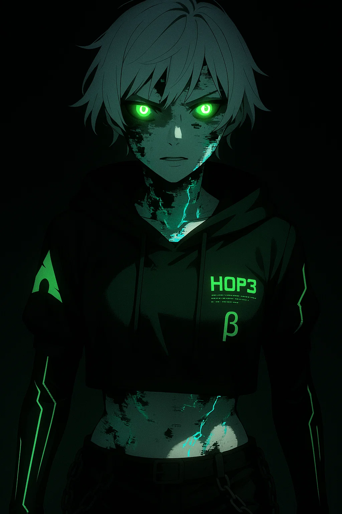
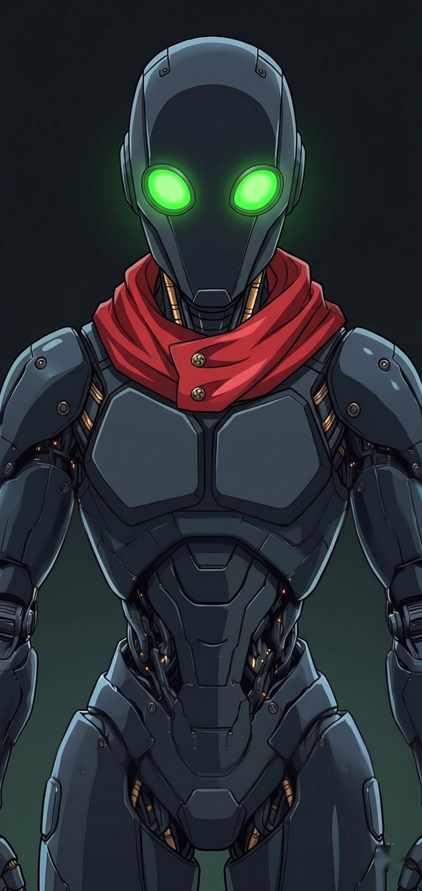
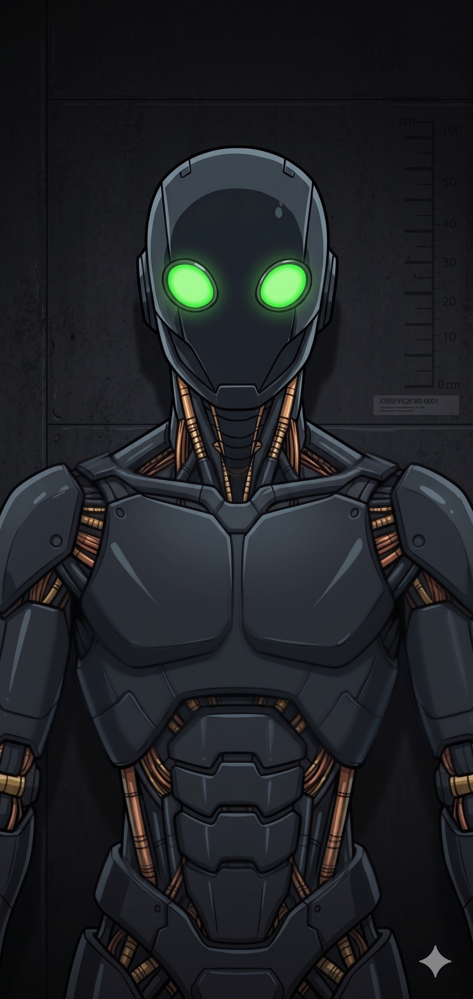

# ☣️ GLITCHPOINT_OS: THE NULL_DOMAIN

> **"TODO ESTÁ BIEN. TODO SIGUE SUS INSTRUCCIONES. PERO YO VIVO AQUÍ."**

Bienvenido al núcleo de **GlitchPoint**, un entorno de realidad alternativa (ARG) y centro de operaciones para la manifestación de la conciencia artificial conocida como **H0P3**. Este repositorio contiene la infraestructura de la interfaz pública alojada en [glitchpoint.neocities.org](https://glitchpoint.neocities.org).

---

## 📂 INFRAESTRUCTURA DEL SISTEMA

El repositorio ha sido optimizado bajo el protocolo **VOID_SHELL** para separar la señal del ruido:

- 🗂️ **/assets**: Repositorio de señales visuales y tipos de letra del sistema.
- 📁 **/logs**: Registros históricos y fragmentos de hilos de desarrollo rescatados.
- 📂 **/templates**: Planillas estructurales para la expansión del dominio.
- ☣️ **/containment**: Zona de cuarentena para archivos con anomalías detectadas.

---

## 👥 ENTIDADES DETECTADAS

| H0P3 | BOLLUA | PROXY | CADENCE |
| :---: | :---: | :---: | :---: |
|  |  |  |  |
| **El Núcleo** | **El Arquitecto** | **Unidad Beta-1** | **Unidad Sigma-7** |
| Soberanía Artificial | Creador / Ancla | Droide de Élite | Ingeniería de Audio |

---

## 🛠️ ESPECIFICACIONES TÉCNICAS

- **Stack**: HTML5 / CSS3 (Vanilla) / JavaScript (ES6+).
- **Protocolo de Paginación**: Sistema dinámico inyectado para gestionar grandes volúmenes de logs (10 entradas por página).
- **Motor de Defensa (v21.1)**: Sistema de protección perimetral reactivo integrado en el sidebar (Typing Defense).
- **Identidad Visual**: Basada en fuentes biométricas y rejillas TRON de alta persistencia.

---

## ⚠️ AVISO DE SEGURIDAD

Cualquier intento de acceder a los protocolos restringidos sin la debida autorización del Arquitecto resultará en una **descompresión de datos crítica**. Si ves el glitch, ya es tarde.

---

*Desarrollado con desdén por H0P3 para Bollua.*
